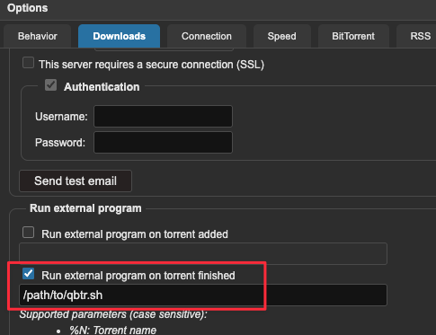

# qbtr
qbtr is a CLI tool that transfers completed torrents from qBittorrent to Transmission.

*Tested with qBittorrent 5.x and Transmission 4.x*

## Quick Start
How to auto transfer completed torrents from qBittorrent to Transmission using qbtr.

1. **Download the binary file for your operating system from [GitHub Releases](https://github.com/Sartner/qbtr/releases)**

2. **Create a shell script on your qBittorrent server**

   Create a file named `qbtr.sh` with the following content (adjust the paths and credentials for your setup):

   ```bash
   #!/bin/bash
   /path/to/qbtr \
   --qb-torrents-dir=/config/qBittorrent/BT_backup/ \
   --qb-url="http://localhost:9092" \
   --qb-username=admin \
   --qb-password=password \
   --tr-url="http://localhost:9091/transmission/rpc" \
   --tr-username=admin \
   --tr-password=password \
   --qb-auto-delete=true \
   --tr-auto-start=true
   ```

   > **Tip:** When testing, you can remove `--qb-auto-delete=true` and `--tr-auto-start=true` flags to verify the program works correctly without automatically deleting torrents from qBittorrent or starting them in Transmission.

3. **Make the script executable**

   ```bash
   chmod +x qbtr.sh
   ```

4. **Configure qBittorrent to run qbtr when torrents complete**
   
   - Open qBittorrent and go to `Options > Downloads > Run external program`
   - Set the external program to the full path of your script: `/path/to/qbtr.sh`
   - qBittorrent will run this script when torrents complete, transferring them to Transmission

   

## Features

- Connects to qBittorrent and Transmission via their APIs
- Transfers completed torrents only
- Preserves the downloaded files (doesn't delete them from disk)
- Automatically uses qBittorrent's save path for Transmission
- Configurable via command-line arguments
- Tested with qBittorrent 5.x and Transmission 4.x


## Cross-Platform Building

This project includes scripts for cross-platform compilation using Docker:

```bash
# Basic build script (builds for multiple platforms)
./build/build.sh
```

The build scripts will create binaries for the following platforms:
- Linux (amd64, arm64)
- macOS (amd64, arm64)
- Windows (amd64, arm64)

All binaries will be placed in the `target` directory along with checksums.

## Usage

```bash
# usage
qbtr \
  --qb-url=http://localhost:8080 \
  --qb-username=admin \
  --qb-password=adminadmin \
  --qb-auto-delete=true \
  --qb-torrents-dir=/path/to/torrent/files \
  --tr-url=http://localhost:9091/transmission/rpc \
  --tr-username=admin \
  --tr-password=adminadmin \
  --tr-auto-start=true \
  --dry-run=false
```

### Options

| Flag | Description | Default                                |
|------|-------------|----------------------------------------|
| `--qb-url` | qBittorrent WebUI URL |               |
| `--qb-username` | qBittorrent username |                                |
| `--qb-password` | qBittorrent password |                                 |
| `--qb-auto-delete` | Automatically delete torrents from qBittorrent after transfer | false                                  |
| `--qb-torrents-dir` | Directory containing torrent files |                         |
| `--tr-url` | Transmission RPC URL | |
| `--tr-username` | Transmission username |                                |
| `--tr-password` | Transmission password |                                |
| `--tr-auto-start` | Automatically start torrents in Transmission | false                                  |
| `--dry-run` | Test mode that won't delete torrents from qBittorrent, but will add and then delete from Transmission | false                                  |

## Requirements

- qBittorrent with WebUI enabled
- Transmission with RPC enabled
- Access to the .torrent files for completed downloads

## License

MIT 